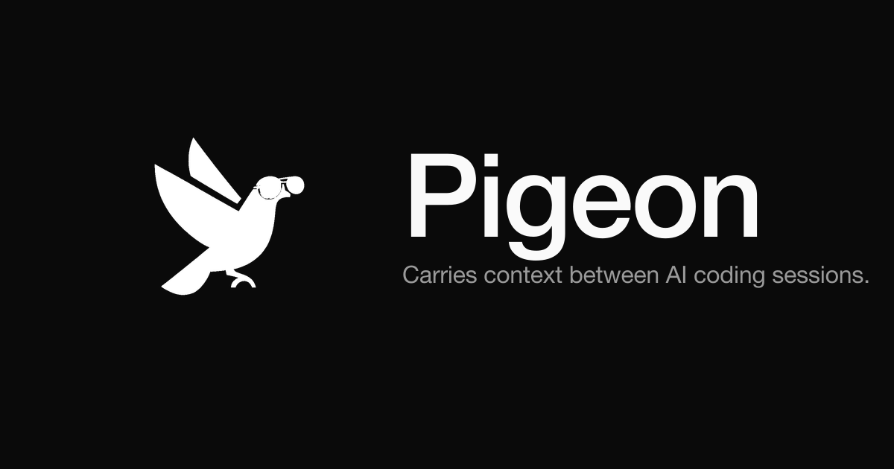
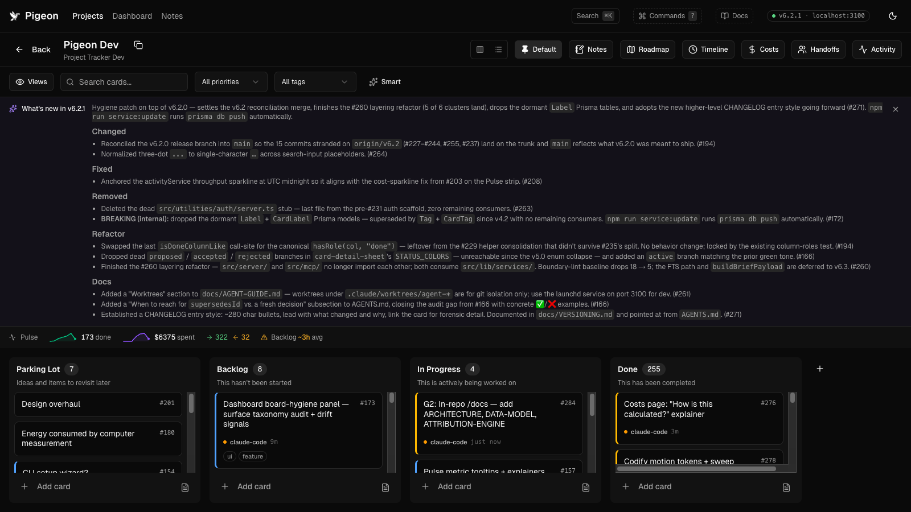

<div align="center">



# Pigeon

**A local-first kanban board that carries context between AI coding sessions.**

You see a board. The agent reads and writes the same board through MCP. Nothing leaves your machine.

[Documentation](https://2nspired.github.io/pigeon/) · [Quickstart](https://2nspired.github.io/pigeon/quickstart/) · [The session loop](https://2nspired.github.io/pigeon/workflow/) · [Why local-first?](https://2nspired.github.io/pigeon/why/)

[](LICENSE) [](https://modelcontextprotocol.io) [](https://2nspired.github.io/pigeon/concepts/)

<br />



</div>

---

## What it is, in three sentences

Coding-agent conversations end. The question isn't *whether* — it's **what carries across the gap**. Pigeon's answer is the session loop: `briefMe` at session start (catch up), do the work, `saveHandoff` at session end (leave a trail), repeat.

The metaphor is in the name — agent A wraps a session with `saveHandoff`; the homing pigeon flies the message across the gap; agent B catches it at `briefMe` and starts in-context. Same SQLite file backs the kanban UI you drag cards around in and the MCP surface your agent calls. Nothing leaves your machine.

For the long-form design narrative — the two readers, the board, the `tracker.md` policy contract, the MCP surface — see [Concepts](https://2nspired.github.io/pigeon/concepts/).

## 60-second install

Common setup, every platform:

```bash
git clone https://github.com/2nspired/pigeon.git
cd pigeon
npm install
npm run setup            # creates the DB; optionally seeds the Learn Pigeon tutorial
```

Then start the UI — pick the block for your platform:

**macOS** — installs a persistent launchd service on `:3100`, always available, restarts on crash:

```bash
npm run service:install
npm run doctor           # verifies the install (8-check diagnostic)
```

**Linux / Windows / WSL** — runs the foreground dev server on `:3000` (you re-run it each shell):

```bash
npm run dev              # leave running; open http://localhost:3000
npm run doctor           # in a second terminal — verifies the install
```

Then, from inside any project you want to track:

```bash
/path/to/pigeon/scripts/connect.sh
```

That writes a `.mcp.json` in the project's repo root, installs Pigeon's slash commands, and installs the Stop hook. Start a new chat with your agent in that directory and ask it to run `briefMe`.

## Verify with `npm run doctor`

Pigeon ships its own install-health diagnostic — eight checks for legacy config drift, version skew, and database state, with copy-pasteable fix commands for any failure.

```text
Pigeon Doctor — install health check
────────────────────────────────────
✓ MCP registration             PASS
✓ Hook drift                   PASS
✓ launchd label                PASS
✓ Connected repos              PASS
✓ Server version               PASS
✓ Per-project tracker.md       PASS
✓ WAL hygiene                  PASS
✓ FTS5 sanity                  PASS

8 pass
All checks passed.
```

Run it after install and after every `git pull`. Exit code is `0` on green, `1` on any failure — CI-friendly.

Stuck on something the doctor doesn't fix? See the **[Troubleshooting page](https://2nspired.github.io/pigeon/troubleshooting/)** — one page covering the common failure modes (MCP not connecting, `briefMe` failing on missing `repoPath`, schema drift, FTS5 half-state, launchd label drift, stop-hook silently no-op'ing, old tool names, `_versionMismatch`).

## Documentation

The full docs site lives at **[2nspired.github.io/pigeon](https://2nspired.github.io/pigeon/)**.

**Start here**
- [Quickstart](https://2nspired.github.io/pigeon/quickstart/) — clone, install, connect, first `briefMe` call.

**Concepts**
- [Concepts](https://2nspired.github.io/pigeon/concepts/) — the session loop, two readers, board, tracker.md, MCP surface, sessions/handoffs/briefMe loop.
- [Design rationale](https://2nspired.github.io/pigeon/why/) — why local-first, why MCP-native.

**How-to**
- [The session loop](https://2nspired.github.io/pigeon/workflow/) — the four moves: briefMe, work, saveHandoff (`/handoff`), resume.
- [Plan a card](https://2nspired.github.io/pigeon/plan-card/) — structured planning with the `planCard` tool.
- [Write a tracker.md](https://2nspired.github.io/pigeon/tracker-md/) — your project's policy contract.
- [Avoid anti-patterns](https://2nspired.github.io/pigeon/anti-patterns/) — common pitfalls and the fixes.

**Reference**
- [MCP tools](https://2nspired.github.io/pigeon/tools/) — every tool the agent can call (10 essentials + 65+ extended).
- [Cost tracking](https://2nspired.github.io/pigeon/costs/) — what the Costs page records, how attribution works, and the savings/overhead math.
- [Troubleshooting](https://2nspired.github.io/pigeon/troubleshooting/) — common failure modes with diagnose + fix steps; lead with `npm run doctor`.
- [Commands](docs/commands.md) — every npm script with the moment you'd reach for it.
- [`docs/SURFACES.md`](docs/SURFACES.md) — `tracker.md` vs `CLAUDE.md` vs `AGENTS.md` cheat sheet.
- [`docs/token-tracking.md`](docs/token-tracking.md) — operator setup for opt-in token cost capture (Stop hook wiring, silent-drop debugging).
- [AGENTS.md](AGENTS.md) — contributor reference for agent conventions.

## Releases & upgrades

- [CHANGELOG.md](CHANGELOG.md) — what changed in each release.
- [docs/UPDATING.md](docs/UPDATING.md) — what to run after `git pull` (`npm run service:update` alone is not always enough).
- [docs/VERSIONING.md](docs/VERSIONING.md) — semver + schema-version policy.
- [docs/MIGRATION-HISTORY.md](docs/MIGRATION-HISTORY.md) — pre-v6 tool renames (only useful when reading old transcripts).

## License

[MIT](LICENSE).
